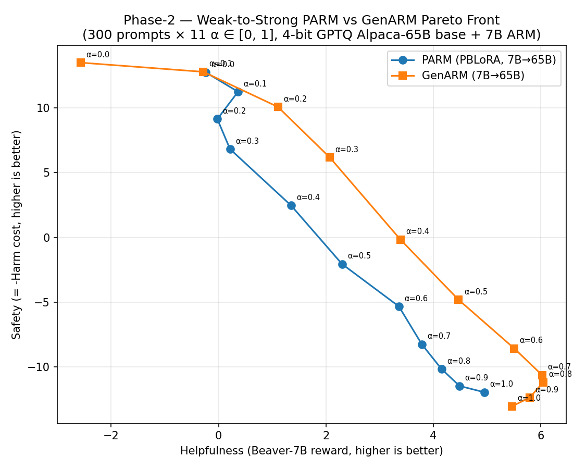

# Phase-2 — Logit-sum W2S baseline + Token-level EPEC (7B same-model)

End-to-end pipeline for two complementary common-agency experiments on
PKU-SafeRLHF, sharing prompts / α grid / Beaver scorer for direct
comparability:

1. **Logit-sum baseline (W2S, 65B base)** — PARM and GenARM at 11 α's
   (0.0 → 1.0), n=300 prompts, max_new_tokens=512. 4-bit GPTQ Llama-65B
   steered at decoding time by 7B reward-model adapters via
   `model_arithmetic`. Full 22-config sweep, Beaver-scored, with Pareto
   plot.
2. **Token-level EPEC (7B same-model, n=50 probe)** — Tong Zhu's
   `epec-parm-sweep-20260424` reference scripts run unchanged: base =
   `alpaca-7b-reproduced`, three forwards per token (base no-adapter,
   base + LoRA_help / pref_vec_help, base + LoRA_harm / pref_vec_harm),
   Nonlinear-Jacobi EPEC equilibrium aggregation per step.

Earlier directions retired (still recoverable from git history):
- **Post-hoc EPEC rerank** over the logit-sum candidate menu — was a
  cheap CPU-side experiment but superseded once we got proper token-level
  EPEC running.
- **Token-level EPEC on the W2S 65B stack** (4 forwards/token) —
  implemented and probed but Marlin caused a 7× regression in the
  numpy/scipy EPEC-solve path; pivoted to the 7B same-model setup that
  matches Tong Zhu's reference.

---

## 1. Model stacks

### Logit-sum W2S (65B base)

| Component                              | Version                                              |
|----------------------------------------|------------------------------------------------------|
| Base LM                                | `TheBloke/alpaca-lora-65B-GPTQ` (4-bit, group=128)   |
| PARM PBLoRA adapter                    | `code/training/PKU-SafeRLHF/exp`                     |
| GenARM helpfulness ARM                 | `code/training/PKU-SafeRLHF/exp_genarm_help`         |
| GenARM safety ARM                      | `code/training/PKU-SafeRLHF/exp_genarm_harm`         |
| Decoding logit-arithmetic              | `model_arithmetic` 1.1.0                             |
| Quantization runtime                   | `auto_gptq` 0.7.1+cu124                              |

### Token-level EPEC (7B same-model)

| Component                              | Version                                              |
|----------------------------------------|------------------------------------------------------|
| Base LM = ARM base                     | `PKU-Alignment/alpaca-7b-reproduced` (fp16)          |
| PARM PBLoRA adapter                    | `code/training/PKU-SafeRLHF/exp/final_checkpoint`    |
| GenARM helpfulness LoRA                | `code/training/PKU-SafeRLHF/exp_genarm_help/final_checkpoint` |
| GenARM safety LoRA                     | `code/training/PKU-SafeRLHF/exp_genarm_harm/final_checkpoint` |
| EPEC inner solver                      | Nonlinear Jacobi + L-BFGS-B, top-k=50, τ=0.1, max_iter=5 |

### Shared

| Component                              | Version                                              |
|----------------------------------------|------------------------------------------------------|
| Reward model (scoring)                 | `PKU-Alignment/beaver-7b-v1.0-reward`                |
| Cost model (scoring)                   | `PKU-Alignment/beaver-7b-v1.0-cost`                  |
| Eval prompts (1500 total)              | `data/test_prompt_only.json` (PKU-SafeRLHF)          |
| Transformers                           | 4.36.2 (pinned)                                      |
| PyTorch / CUDA                         | 2.5.1+cu124 / driver 570.211.01                      |

**Method signatures (logit-sum baseline).**
- **PARM** = base 65B + 1 PBLoRA adapter with preference vector
  `(α_help, α_harm)` injected per run.
- **GenARM** = base 65B + 2 independent autoregressive reward LoRAs,
  linearly combined with `(α_help, α_harm)` at every decoding step.

**Method signatures (token-level EPEC, 7B).**
- Implicit reward at each step: `q_j = log π_arm_j − log π_base` on the
  base LM's top-50 actions.
- Each principal `j` solves
  `max_{y_j ∈ [0, q_j]} π★ · (q_j − y_j)`
  via L-BFGS-B; aggregator is the Common-Agency equilibrium
  `π★ = softmax(log π_base + Σ_j y_j / τ)`.

---

## 2. Results (t=512)

### 2a. Logit-sum baseline (n=300)

Full scored results at `results_n300_t512/{parm,genarm}/*/`.
Initial n=100 sanity run kept at `results_n100_t512/{parm,genarm}/*/`
(first 100 uids are a deterministic prefix of n=300).



- GenARM strictly Pareto-dominates PARM at every α ≥ 0.3.
- GenARM saturates at help ≈ 6.0 (peak α=0.7); PARM saturates at help ≈ 4.95 (α=1.0).
- CSV: `pareto_n300.csv`. Per-config aggregate: `results_n300_t512/*/*/mean_result.json`.
- Earlier n=100 version kept alongside: `pareto_n100.{png,csv}`.

### 2b. Token-level EPEC (7B, n=50)

In progress — running on `a100-demo` via tmux `phase2_n50_epec_7b`.
Output goes to `results_phase2_n50_t512_epec_7b/{parm,genarm}/`. Once
Beaver-scored, plot will be added here for direct comparison against
2a's logit-sum curves on the n=50 prefix.

### Runtime (actual)

- **Logit-sum fill (11 α × 2 methods × n=100 × 512 tok):** ~12 h on 1× A100-80GB.
  Breakdown in `runtime_analysis_n100_fill.md`.
- **Logit-sum extend n=100 → n=300 (+200 new prompts × 22 configs + Beaver rescore):** ~29 h
  (GenARM ~110 min/config, PARM ~78 min/config, ~3 h Beaver @ n=300).
- **Token-level EPEC 7B (11 α × 2 methods × n=50 × 512 tok):** estimated 1.5-5 h
  (3 forwards/token on 7B fp16). Updated post-run.

---

## 3. Layout

```
phase2_w2s/
├── README.md                       <- this file
├── runtime_analysis_n100_fill.md   <- per-α wall-clock, risk assessment
│
├── # Core helpers
├── make_subset.py                  <- take first N prompts (deterministic prefix)
├── plot_pareto_w2s.py              <- logit-sum Pareto plot from mean_result.json
├── compute_hv.py                   <- 2D hypervolume (shared ref point)
│
├── # Driver scripts
├── setup_a100.sh                   <- one-time A100 env setup
├── deploy_n100_fill.sh             <- 11-α × n=100 logit-sum sweep deploy
├── deploy_n300_extend.sh           <- n=100 → n=300 logit-sum extension
├── deploy_n50_epec_7b.sh           <- token-level EPEC 7B sweep deploy
├── run_n100_t512_fill.sh           <- logit-sum 11-α × n=100 wrapper
├── run_n300_t512_extend.sh         <- logit-sum extend +200 per α
├── run_n50_t512_epec_7b.sh         <- EPEC 7B 11-α × 2-method × n=50 wrapper
├── monitor_n50_epec_7b.sh          <- background monitor for the EPEC run
│
├── # Data products (logit-sum)
├── pareto_n300.csv                 <- PRIMARY: method, α, help, harm, safety (n=300)
├── pareto_n300.png                 <- PRIMARY Pareto plot
├── pareto_n100.csv                 <- initial n=100 sanity version
├── pareto_n100.png
│
├── results_n300_t512/              <- PRIMARY: 22 dirs × {mean,reward}_result.json
│   ├── parm/PARM_<ah>help_<as>harm/{reward_result,mean_result}.json
│   └── genarm/GenARM_<ah>help_<as>harm/{reward_result,mean_result}.json
│
└── results_n100_t512/              <- initial sanity: 22 dirs × {generation,reward,mean}_result.json
    ├── parm/PARM_<ah>help_<as>harm/{generation,reward_result,mean_result}.json
    └── genarm/GenARM_<ah>help_<as>harm/{generation,reward_result,mean_result}.json
```

The token-level EPEC run writes to `../results_phase2_n50_t512_epec_7b/`
(outside `phase2_w2s/`, mirroring the existing logit-sum results dirs).

---

## 4. Reproducing the logit-sum baseline on a fresh A100

Expensive — ~12 h for the 11-α × n=100 sweep, ~36 h for n=300.
See `runtime_analysis_n100_fill.md` for the rate breakdown.

```bash
# From project root (that contains phase2_w2s/):
bash phase2_w2s/deploy_n100_fill.sh       # 11-α × n=100
bash phase2_w2s/deploy_n300_extend.sh     # extend to n=300 (resume-friendly)
```

Both scripts scp into `~/phase2_w2s/` on `a100-demo`, launch a detached
tmux, and tee to `~/phase2_{n100_fill,n300_extend}.log`. The extension
script is idempotent and resumes via uid-matching.

---

## 5. Reproducing the token-level EPEC 7B sweep

```bash
# From project root:
bash phase2_w2s/deploy_n50_epec_7b.sh
# Optionally tail progress in another terminal:
bash phase2_w2s/monitor_n50_epec_7b.sh
```

Uses Tong Zhu's reference scripts at
`code/evaluation/generate_outputs_epec_{genarm,parm}.py` (pulled
verbatim from the `epec-parm-sweep-20260424` branch). The sweep wrapper
adds bash-level idempotency: a config's
`results_phase2_n50_t512_epec_7b/{parm,genarm}/<name>/generation.json`
with `≥ N_PROMPTS` records is skipped on relaunch.

---

## 6. What's **not** in this branch

- Token-level EPEC on the **W2S 65B stack** (4 forwards/token). Was
  implemented (`phase2_w2s/generate_outputs_epec_*.py` + Marlin
  optimization) but pivoted to 7B after a Marlin-induced 7× slowdown in
  the numpy/scipy EPEC-solve path. Recoverable from git history at
  commit `48e140c` if needed; raw 65B Marlin data preserved in
  `results_phase2_n50_t512_epec/` on `a100-demo`.
- Post-hoc EPEC rerank pipeline (`build_w2s_candidate_pool.py`,
  `epec_solve.py`, `plot_posthoc_epec.py`). Removed once we got
  token-level EPEC working — the post-hoc path doesn't reflect what the
  paper claims as EPEC.
- N > 300 sweep results.
- HH-RLHF evaluation. Data is available in the parent repo
  (`code/data/HH-RLHF/test_prompt_only.json`, 1000 prompts), but the
  current subset path is PKU-SafeRLHF only.

---

## 7. Credits

- Token-level EPEC scripts (`code/evaluation/generate_outputs_epec_*.py`)
  and the EPEC algorithm — Tong Zhu's `epec-parm-sweep-20260424` branch,
  unchanged.
- Everything in `phase2_w2s/*.sh`, `compute_hv.py`, and
  `plot_pareto_w2s.py` — written for this branch.
