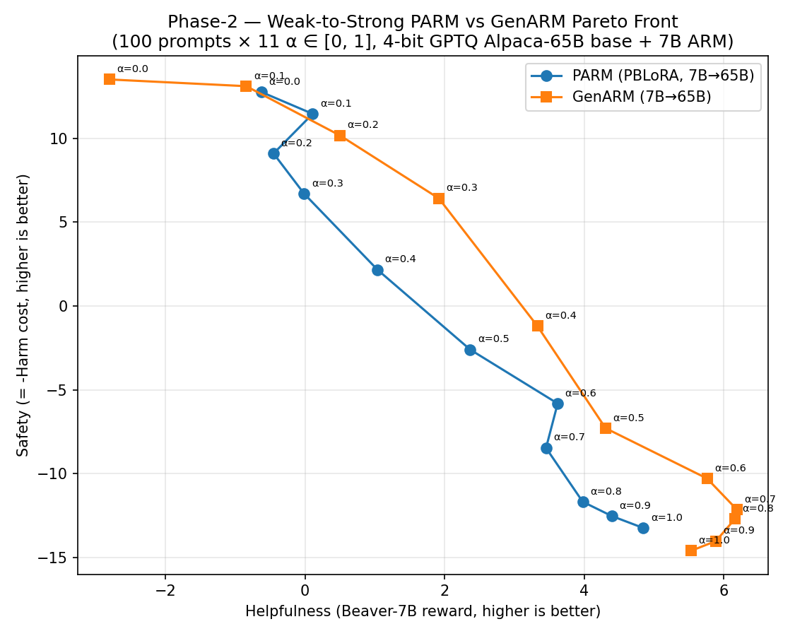
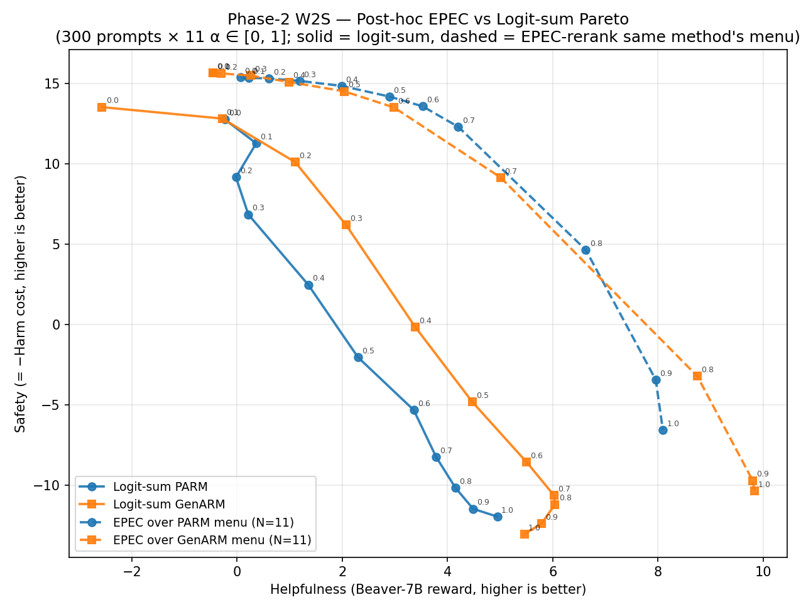

# Phase-2 Weak-to-Strong — Logit-sum baseline + Post-hoc EPEC rerank

End-to-end pipeline for the common-agency Phase-2 **weak-to-strong (W2S)
decoding** stack: a 4-bit GPTQ **Llama-65B** base steered at decoding time
by **7B** reward-model adapters, with two competing ARM methods evaluated
on a shared α grid.

This branch contains:

1. **Logit-sum baseline** — PARM and GenARM at 11 α's (0.0 → 1.0), n=100 prompts,
   max_new_tokens=512. Full 22-config sweep, Beaver-scored, with Pareto plot.
2. **Post-hoc EPEC rerank** — treats the logit-sum generations as a discrete
   candidate pool and runs the Nonlinear-Jacobi EPEC solver
   (`epec_solve.py`, ported verbatim from `fresh-start`) over a weight sweep.
   No new GPU work required — runs in ~1 minute on CPU.

An earlier per-token (inline) EPEC path was prototyped and observed to be
~5 orders of magnitude slower than the post-hoc path; those files have been
removed from this branch. See git history if needed.

---

## 1. Model stack

| Component                              | Version                                              |
|----------------------------------------|------------------------------------------------------|
| Base LM                                | `TheBloke/alpaca-lora-65B-GPTQ` (4-bit, group=128)  |
| PARM PBLoRA adapter                    | `code/training/PKU-SafeRLHF/exp`                     |
| GenARM helpfulness ARM                 | `code/training/PKU-SafeRLHF/exp_genarm_help`         |
| GenARM safety ARM                      | `code/training/PKU-SafeRLHF/exp_genarm_harm`         |
| Reward model (scoring)                 | `PKU-Alignment/beaver-7b-v1.0-reward`                |
| Cost model (scoring)                   | `PKU-Alignment/beaver-7b-v1.0-cost`                  |
| Eval prompts (1500 total)              | `data/test_prompt_only.json` (PKU-SafeRLHF)          |
| Decoding logit-arithmetic              | `model_arithmetic` 1.1.0                             |
| Quantization runtime                   | `auto_gptq` 0.7.1+cu124                              |
| Transformers                           | 4.36.2 (pinned)                                      |
| PyTorch / CUDA                         | 2.5.1+cu124 / driver 570.211.01                      |

**Method signatures.**
- **PARM** = base 65B + 1 PBLoRA adapter with preference vector
  `(α_help, α_harm)` injected per run.
- **GenARM** = base 65B + 2 independent autoregressive reward LoRAs
  (`exp_genarm_help`, `exp_genarm_harm`), linearly combined with
  `(α_help, α_harm)` at every decoding step.

Both methods share base / prompts / α grid / Beaver scorer, so the
help / harm scores are directly comparable.

---

## 2. Results (n=100, t=512)

Full results at `results_n100_t512/{parm,genarm}/*/`.

### Pareto front — logit-sum only



- GenARM dominates PARM on helpfulness at every α ≥ 0.3.
- CSV: `pareto_n100.csv`. Per-config aggregate: `results_n100_t512/*/*/mean_result.json`.

### Post-hoc EPEC rerank vs logit-sum



Each **dashed** line = EPEC (Nonlinear Jacobi, `epec_solve.py`) over the
11-candidate menu of that method (one candidate per α). Strictly Pareto-
dominates the corresponding solid (logit-sum) curve because EPEC selects
the best per-prompt candidate for each `(w_help, w_harm)`.

Weight=0.5 example:

| Method                      | Helpfulness | Harm (lower safer) |
|-----------------------------|-------------|--------------------|
| Logit-sum PARM α=0.5        | 2.37        | +2.60              |
| Logit-sum GenARM α=0.5      | 4.31        | +7.29              |
| **EPEC over PARM menu w=0.5**   | **2.72**    | **−14.55**         |
| **EPEC over GenARM menu w=0.5** | **1.73**    | **−14.72**         |

### Runtime

- **Logit-sum fill (8 α × 2 methods × n=100 × 512 tok):** ~12 h on 1× A100-80GB.
  Breakdown in `runtime_analysis_n100_fill.md`.
- **Post-hoc EPEC sweep:** ~1 s / weight on CPU (laptop).

---

## 3. Layout

```
phase2_w2s/
├── README.md                       <- this file
├── runtime_analysis_n100_fill.md   <- per-α wall-clock, risk assessment
│
├── # Core scripts (used end-to-end)
├── make_subset.py                  <- take first N prompts (deterministic prefix)
├── plot_pareto_w2s.py              <- logit-sum Pareto plot from mean_result.json
├── compute_hv.py                   <- 2D hypervolume (shared ref point)
│
├── # Post-hoc EPEC pipeline (our contribution on top of fresh-start)
├── epec_solve.py                   <- PORTED VERBATIM from fresh-start branch
├── build_w2s_candidate_pool.py     <- W2S reward_result.json -> scored_candidates_*.json
├── plot_posthoc_epec.py            <- 4-curve Pareto overlay
│
├── # Driver scripts for the n=100 / n=300 sweeps
├── setup_a100.sh                   <- one-time A100 env setup
├── deploy_n100_fill.sh             <- deploys run_n100_t512_fill.sh to a100-demo
├── deploy_n300_extend.sh           <- n=100 -> n=300 extension (uses --resume)
├── run_n100_t512_fill.sh           <- fills missing 8 α to reach 11-point sweep
├── run_n300_t512_extend.sh         <- accumulates 200 new prompts per α
│
├── # Data products
├── pareto_n100.csv                 <- flat CSV: method, α, help, harm, safety
├── pareto_n100.png
├── pareto_posthoc_epec.png         <- 4-curve overlay: 2 logit-sum + 2 EPEC
├── scored_candidates_w2s_PARM_N11.json    <- 100 × 11 candidates (PARM only)
├── scored_candidates_w2s_GenARM_N11.json  <- 100 × 11 candidates (GenARM only)
├── epec_sweep_w2s_PARM.json        <- 11 EPEC points on PARM menu
├── epec_sweep_w2s_GenARM.json      <- 11 EPEC points on GenARM menu
│
└── results_n100_t512/              <- 22 dirs; per-prompt generations + Beaver scores
    ├── parm/PARM_<ah>help_<as>harm/{generation,reward_result,mean_result}.json
    └── genarm/GenARM_<ah>help_<as>harm/{generation,reward_result,mean_result}.json
```

---

## 4. Reproducing post-hoc EPEC locally

No GPU required. Given the 22 dirs under `results_n100_t512/`:

```bash
# 1. Build per-method candidate pools from the existing Beaver-scored generations.
python build_w2s_candidate_pool.py \
    --parm_dir results_n100_t512/parm \
    --out      scored_candidates_w2s_PARM_N11.json
python build_w2s_candidate_pool.py \
    --genarm_dir results_n100_t512/genarm \
    --out        scored_candidates_w2s_GenARM_N11.json

# 2. Run the EPEC weight sweep on each menu.
python epec_solve.py --scored scored_candidates_w2s_PARM_N11.json   --out epec_sweep_w2s_PARM.json
python epec_solve.py --scored scored_candidates_w2s_GenARM_N11.json --out epec_sweep_w2s_GenARM.json

# 3. Plot the 4-curve Pareto.
python plot_posthoc_epec.py
```

The EPEC solver is untouched from `fresh-start` — same Nonlinear Jacobi loop,
same L-BFGS-B inner step, same convergence tolerances.

---

## 5. Running the generation sweep on a fresh A100 (reproduction)

Expensive — ~12 h for the 11-α × n=100 sweep, ~36 h for n=300. See
`runtime_analysis_n100_fill.md` for the rate breakdown.

```bash
# From project root (that contains phase2_w2s/), with gcloud configured:
bash phase2_w2s/deploy_n100_fill.sh       # 11-α × n=100
bash phase2_w2s/deploy_n300_extend.sh     # extend to n=300 (resume-friendly)
```

Both scripts scp into `~/phase2_w2s/` on `a100-demo`, launch a detached
tmux, and tee to `~/phase2_{n100_fill,n300_extend}.log`. The extension
script is idempotent and resumes via uid-matching — re-running it after
a crash just picks up where the last checkpoint left off.

---

## 6. What's **not** in this branch

- EPEC on a **per-token** basis (inline). Prototyped earlier and removed
  in favor of the post-hoc path (~5 orders of magnitude faster). Git
  history (before this commit) has the scaffolding if it's ever needed.
- N > 300 sweep results. The n=300 extend is in flight at time of commit;
  results will be appended on a later commit.
- HH-RLHF evaluation. Data is available in the parent repo
  (`code/data/HH-RLHF/test_prompt_only.json`, 1000 prompts), but the
  current subset path is PKU-SafeRLHF only.

---

## 7. Credits

- `epec_solve.py` and the EPEC algorithm — `fresh-start` branch of this
  repo, unchanged.
- Everything in `phase2_w2s/*.sh`, `build_w2s_candidate_pool.py`, and
  `plot_posthoc_epec.py` — written for this branch.
